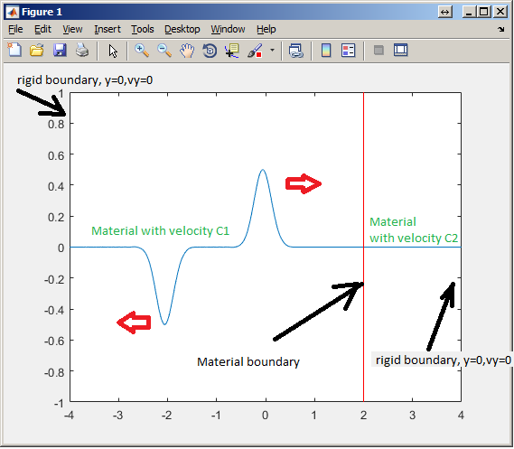

# Demonstration of a discrete wave equation in Matlab

This short script demonstrates the discretized 1D wave equation.

All time-domain frames are saved to a 2D matrix for further analysis. Hence, this script can freeze your Matlab by reserving a huge amount of memory if you are not carefull with the settings.

In this version, there is two materials: material 1 to the left of the red line, and material 2 to the right of the red line. 

This script could be easily modified to support arbitrary material, arbitrary meshing e.t.c - but it is not the point of this work. Here I do not want to replicate what PZFlex does - rather, obtain a basic feel of what PZFlex does and what are the consequences of crossing the Courant limits.

For more info on the Courant number see here:

![https://en.wikipedia.org/wiki/Courant%E2%80%93Friedrichs%E2%80%93Lewy_condition]

====

Have a play with the initial conditions - in particular, see what happens when you increase dt or dx, or reduce the width of the initial wavelet too far. (spoiler: nothing good).

Note the effect of the material change: a reflection occurs.

Have fun! 

p.s. i guess there would be a point in making the per-element material version of this to demonstrate how different material impedance matching schemes work. I'll do that later on.

====

Dr Jerzy Dziewierz, 

CUE 2017

 This work is licensed under a <a rel="license" href="http://creativecommons.org/licenses/by-sa/4.0/">Creative Commons Attribution-ShareAlike 4.0 International License</a>.

